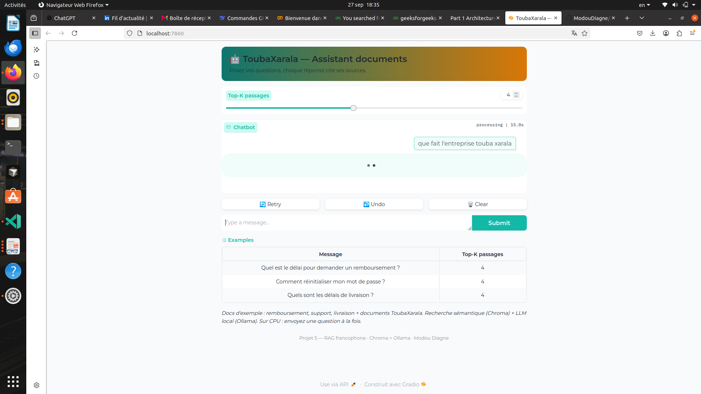
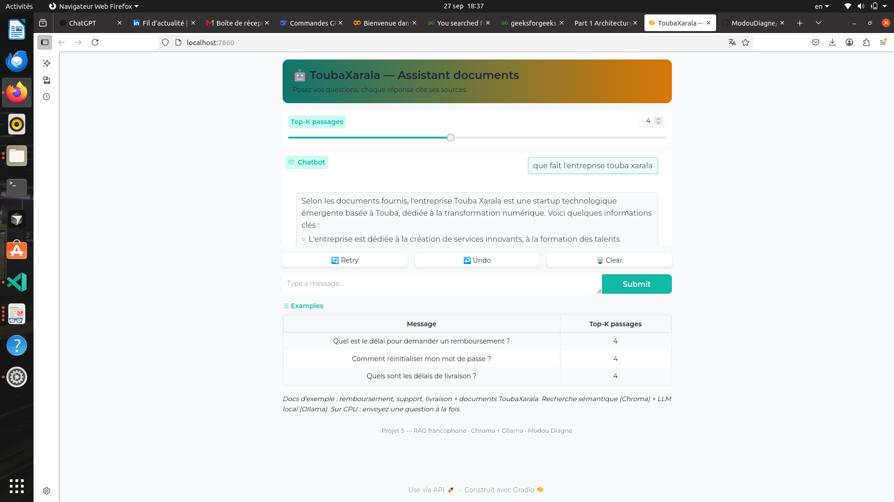

# 🤖 RAG Chatbot — vos documents vous répondent

> **TL;DR (EN):** Local, private Retrieval-Augmented Generation chatbot (French-ready).
> Semantic search (Chroma) + grounded LLM (Ollama/Mistral) with cited sources. CPU-friendly, reproducible, deployable on Hugging Face Spaces.

[](https://www.python.org/)
[](https://www.langchain.com/)
[](https://www.trychroma.com/)
[](https://ollama.com/)
[](LICENSE)

Un chatbot qui répond à des questions **sur vos propres documents** (PDF, TXT, Markdown, HTML)
en citant ses sources — au lieu d'halluciner de mémoire.

## ✨ Pourquoi ce projet ?

| LLM seul | Avec ce RAG |
|---|---|
| Répond de mémoire, hallucine | Répond **documents ouverts**, cite `[1], [2]` |
| Ne connaît pas vos données | Indexe **vos** PDF/notes |
| Boîte noire | Chaque réponse est **traçable** (fichier + page + score) |

## 🏗️ Architecture

```
Question
  │  (1) embedding de la question (MiniLM multilingue, 384 dim)
  ▼
┌─────────────┐   top-k cosine   ┌──────────────┐
│  Chroma DB   │ ◄────────────── │   Retriever  │
│ (persistante)│                 └──────────────┘
└─────────────┘                          │
  ▲  (2) indexation unique                ▼
Chunks ← Recursive splitter ← PDF/MD/TXT nettoyés
                                          │  (3) prompt grounded
                                          ▼
                                   Ollama / Mistral  →  Réponse + sources
```

**Pipeline en 2 temps :**
- **Indexation (1 fois) :** chargement → nettoyage → chunking récursif (800 car., overlap 100) → embeddings → Chroma.
- **Requête (chaque question) :** embedding → top-k → prompt contraint → LLM → réponse citée.

## 📁 Structure

```
rag-chatbot/
├── app.py               # démo Gradio (compatible HF Spaces)
├── requirements.txt
├── data/documents/      # ← mettez vos PDF/MD ici (3 exemples inclus)
├── chroma_db/           # base vectorielle (générée, ignorée par git)
└── src/
    ├── config.py        # tous les réglages (env: RAG_*)
    ├── ingest.py        # Étape 1 — chargement + nettoyage
    ├── clean.py         # normalisation texte
    ├── chunk.py         # Étape 2 — découpage récursif
    ├── embed_index.py   # Étapes 3-4 — embeddings + Chroma
    ├── retriever.py     # Étape 5 — recherche sémantique
    ├── rag_chain.py     # Étape 6 — prompt + LLM + fallback extractif
    └── evaluate.py      # Étape 7 — hit-rate sur 5 questions
```

## 🚀 Installation (5 min)

**Prérequis :** Python 3.9+, ~2 Go disque (modèle d'embedding ~90 Mo).

```bash
git clone https://github.com/<vous>/rag-chatbot.git
cd rag-chatbot
conda create -n rag python=3.9 -y && conda activate rag
pip install -r requirements.txt

# LLM local (gratuit, privé) — dans un autre terminal :
curl -fsSL https://ollama.com/install.sh | sh
ollama pull mistral
```

## ▶️ Utilisation

```bash
# 1. Ajoutez vos documents
cp vos-fichiers.pdf data/documents/

# 2. Indexation (une fois, ou à chaque ajout de docs)
python -m src.embed_index

# 3. Recherche seule (sans LLM)
python -m src.retriever "Comment demander un remboursement ?" -k 4

# 4. RAG complet (avec Ollama si dispo, sinon mode extractif auto)
python -m src.rag_chain "Quel est le délai de remboursement ?"

# 5. Évaluation (hit-rate, sans LLM requis)
python -m src.evaluate

# 6. Démo web
python app.py   # → http://localhost:7860
```

## 🖼️ Démo

Question sur les documents ToubaXarala, réponse générée avec sources :




## 🔌 API REST (socle pour un frontend React)

```bash
uvicorn api:app --host 0.0.0.0 --port 8000
# Docs auto : http://localhost:8000/docs
curl -X POST http://localhost:8000/ask \
  -H "Content-Type: application/json" \
  -d '{"question":"Que propose ToubaXarala ?","provider":"ollama"}'
```

`GET /health` → état de l'index · `POST /ask` → `{answer, sources, provider}`.
Un frontend React/Next.js peut se brancher directement dessus (roadmap v2).

**Variables d'environnement utiles :**

| Variable | Défaut | Rôle |
|---|---|---|
| `RAG_EMBEDDING_MODEL` | `paraphrase-multilingual-MiniLM-L12-v2` | modèle FR, léger CPU |
| `RAG_CHUNK_SIZE` / `RAG_CHUNK_OVERLAP` | `800` / `100` | granularité citations |
| `RAG_TOP_K` | `4` | nb de passages |
| `RAG_LLM_PROVIDER` | `ollama` | `ollama` ou `extractive` |
| `RAG_OLLAMA_MODEL` | `llama3.2:1b` | léger par défaut ; `mistral` si 8 Go+ libres |

## 📊 Évaluation

`python -m src.evaluate` teste 5 questions sur les docs d'exemple (remboursement, support, livraison) :

- **Métrique :** le mot-clé attendu est-il dans le top-k ? (hit-rate, déterministe, sans LLM)
- **Objectif pro :** 5/5 (100 %) sur les docs d'exemple — sinon, ajustez `CHUNK_SIZE` / `TOP_K`.
- Collez votre score dans une issue/PR pour montrer votre rigueur aux recruteurs.

## 🌍 Déploiement

**GitHub :**
```bash
cd rag-chatbot && git init && git add . && git commit -m "feat: RAG chatbot FR + eval" && git push
```
Montrez : README + `src/evaluate.py` + captures de `app.py`.

**Hugging Face Spaces (Gradio) :**
1. Créez un Space **Gradio** → uploadez ce dossier (`app.py` à la racine).
2. Le Space installe `requirements.txt` seul — tout est CPU-compatible.
3. Sans serveur Ollama sur le Space, l'app bascule en mode **extractif** (recherche + citations) : précisez-le dans la description du Space.

## 🗺️ Roadmap

- [x] Étapes 1-7 : ingest → chunk → embed → Chroma → retriever → RAG → eval + Gradio
- [ ] Chunking sémantique + reranker (Cohere/bge)
- [ ] Qdrant en option pour la prod
- [ ] Éval LLM-as-judge (faithfulness, answer relevancy)
- [ ] Docker + CI (lint/test)

## 👤 Auteur

**Modou Diagne** — Ingénieur Logiciel orienté IA (Backend, Microservices, DevOps, Cloud, ML, GenAI, Sécurité).
*Je construis des systèmes qui tiennent en production, pas des démos.*

Près de 3 ans d'expérience : analyse métier, modélisation, architectures microservices / SOA / ERP, APIs robustes, bases relationnelles et réparties, sécurité applicative, cloud et CI/CD.
Côté IA : ML classique, Deep Learning, NLP/BERT, LLM/RAG et agents — créés, entraînés, fine-tunés, évalués, puis exposés et opérés via API (MLOps).

Actuellement au CCAK (Touba) sur le SIGU, ERP universitaire en microservices : backend, dashboards, volet Data (PV, classements, ANAQ-Sup — Python/Pandas, SQL).

Basé au Sénégal, **full remote en priorité** : missions longues, CDI remote, freelance, collaborations ou co-construction produit.

📩 Un système à concevoir ou une équipe à renforcer ? Message privé sur [LinkedIn](https://www.linkedin.com/in/modou-diagne-94b451247/).

## 📄 Licence

MIT — réutilisez, citez, contribuez.
